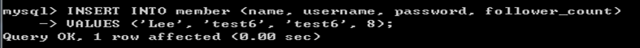

# 作業五
## 登入：
### mysql -h(localhost) -P(Port) -u(user) -p(password)
#### *如有更改port需加-P (port)

## 要求三：SQL CRUD
 - [x] 1. 使用INSERT 指令新增一筆資料到 member 資料表中，這筆資料的 username 和
password 欄位必須是 test。接著繼續新增至少 4 筆隨意的資料。

 - [x] 2. 使用 SELECT 指令取得所有在 member 資料表中的會員資料。
 
 - [x] 3. 使用 SELECT 指令取得所有在 member 資料表中的會員資料，並按照 time 欄位，由近到遠排序。

 - [x] 4. 使用 SELECT 指令取得 member 資料表中第 2 ~ 4 共三筆資料，並按照 time 欄位，由近到遠排序。(並非編號 2、3、4 的資料，而是排序後的第 2 ~ 4 筆資料)

- [x] 5. 使用 SELECT 指令取得欄位 username 是 test 的會員資料。

- [x] 6. 使用 SELECT 指令取得欄位 username 是 test、且欄位 password 也是 test 的資料。

- [x] 7. 使用 UPDATE 指令更新欄位 username 是 test 的會員資料，將資料中的 name 欄位
改成 test2。

## 要求四：SQL Aggregate Functions
 - [x] 1. 取得 member 資料表中，總共有幾筆資料(幾位會員)。

 - [x] 2. 取得 member 資料表中，所有會員 follower_count 欄位的總和。

 - [x] 3. 取得 member 資料表中，所有會員 follower_count 欄位的平均數。

## 要求五：SQL JOIN
 - [x] 1. 在資料庫中，建立新資料表，取名字為message。

 - [x] 2. 使用 SELECT 搭配 JOIN 語法，取得所有留言，結果須包含留言者會員的姓名。

 - [x] 3. 使用 SELECT 搭配 JOIN 語法，取得 member 資料表中欄位 username 是 test 的所有留言，資料中須包含留言者會員的姓名。

# 謝謝!
